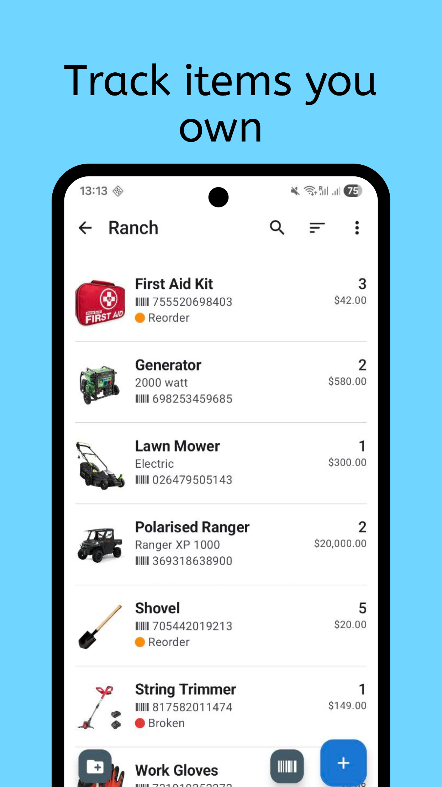
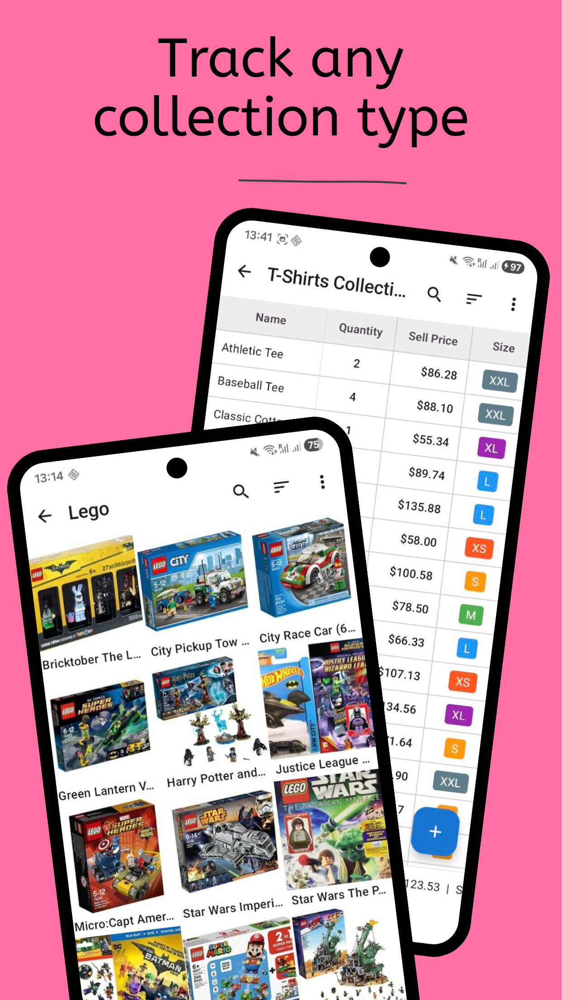
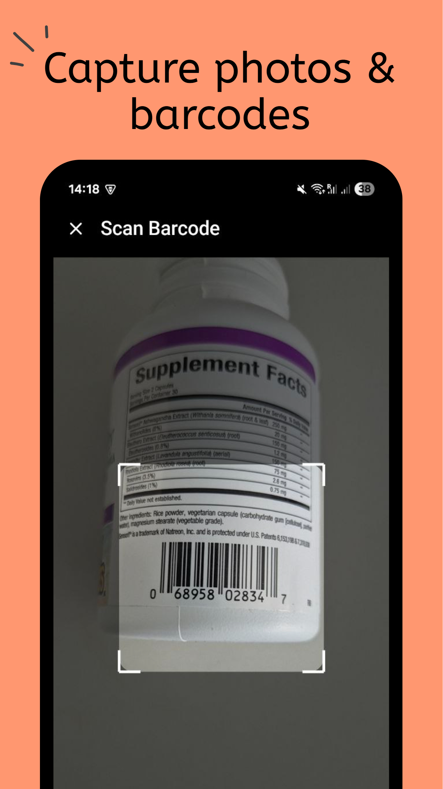
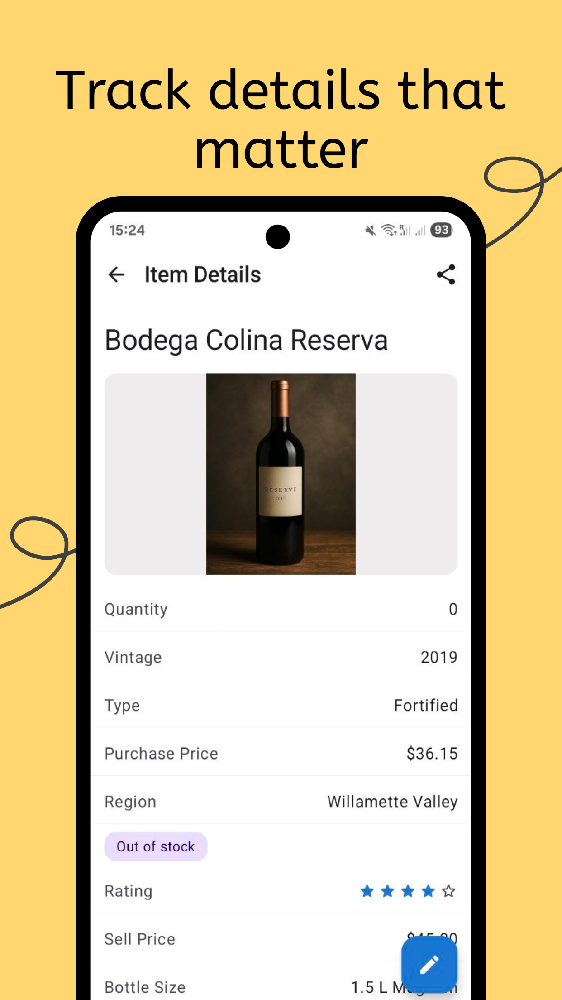
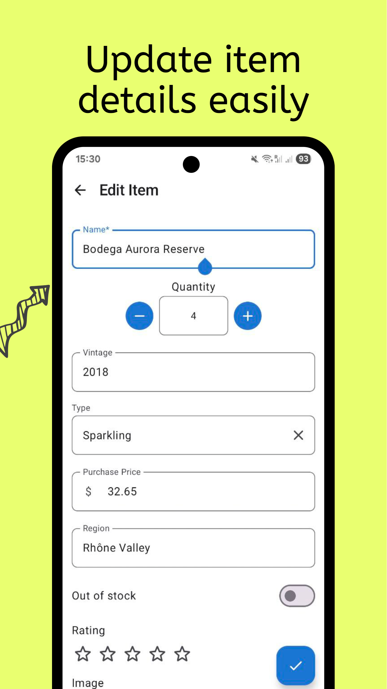
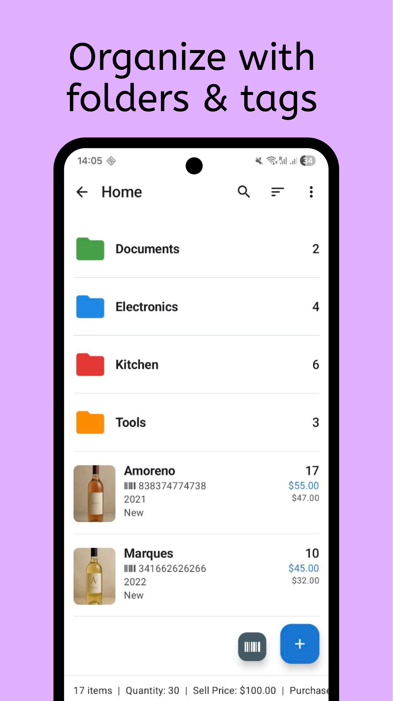
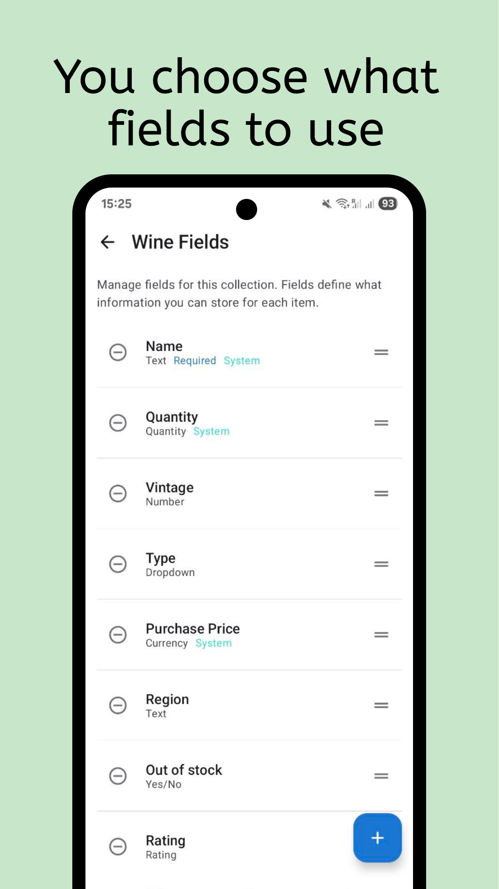
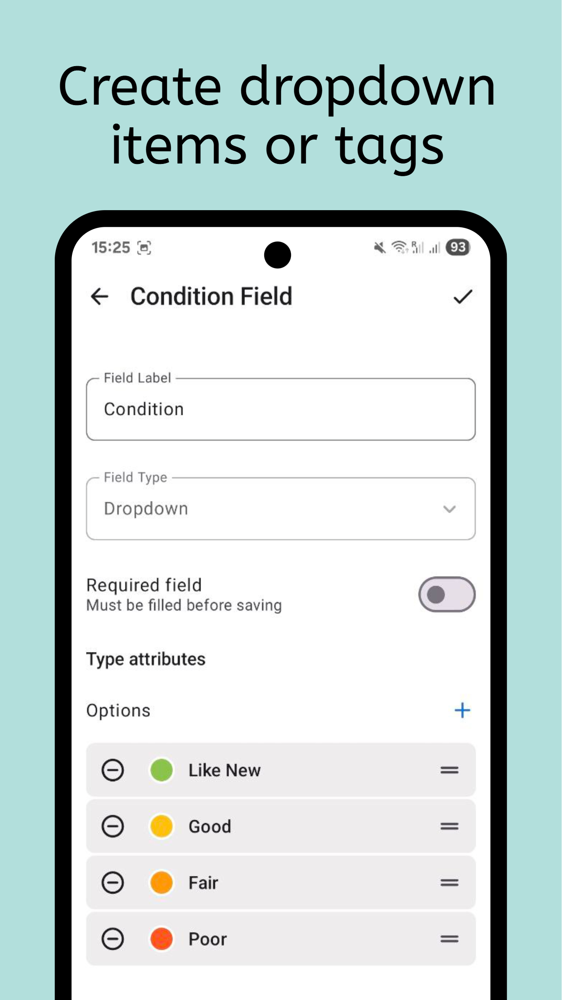

# Collection & Inventory Tracker

  
  
  
  

  
  
  
  

📦 Organize your inventory and collections the smart way! Keep everything in a single item catalog, from home inventory and tools to personal collections. Scan inventory, add items quickly, and use the item tracker to manage your stuff offline. Get organized and catalog your items today!

For hobby collectors, households, and small teams managing shared assets, staying organized is simple here. Powerful inventory management, fast item tracking, and quick search give you control, so you can move on from messy spreadsheets and rely on a smart item organizer.

🗂 Create & Manage Collections

Build collections that match your lifestyle, from books and coins to tools, wine, or crafts. Add items with photos, barcodes, and details like price, rating, or quantity. Sort and classify your inventory collection the way you like. Collect everything in one place and keep it organized with your personal collection tracker.

📷 Scan, Track & Log Inventory

You can add or find items in seconds using the built-in barcode scanner. Scan once to log or update items automatically, then manage quantities and saved items with ease. The app recognizes QR, EAN, and UPC codes, perfect for organizing a craft inventory, tool inventory, or home storage.

🧾 Customize Your Item Catalog

Every collection can have its own fields such as text, numbers, dropdowns, or images. Build your item catalog the way you want: flexible, personal, and easy to use. As your asset manager, it helps you maintain order and precision. Add items quickly, attach photos, or log your inventory by category. If you are tracking a vinyl collection, a DVD collection tracker, or a stamp collection, it stays smooth and intuitive.

🔍 Stay on Top of Your Items

Quickly find anything with instant search and filters by tag, category, folder, or storage location. Sort by name, date, or value, then use quick actions to add items or update quantity so you organize items faster.

🔒 Offline Access & Seamless Sync

Your items stay accessible at all times. Browse collections, edit details, and manage inventory offline. Once online, the app syncs your updates, keeping your personal inventory tracker consistent across devices and places.

👥 Share & Collaborate

Invite others to collaborate on your collections. Assign viewer or editor roles, share updates, or let others help you organize items together. Perfect for families managing a home inventory or teams that track inventory and assets together.

🧠 Smart Organization Made Simple

Design stays simple and clear, so everything is right where you expect it. You can catalog, filter, and organize without limits. From classification tools to multi-view browsing, it is your ultimate stuff organizer for both work and home.

✨ Why users love it
✔️ Easy inventory management for home and teams
✔️ Fast item tracker with barcode scanning
✔️ Fully customizable item catalog and fields
✔️ Reliable offline mode with auto-sync
✔️ Ideal for collectors, families, and teams

From organizing tools and home inventory to growing a vinyl or stamp collection, the app adapts to the way you work. Use the collection tracker and item catalog to manage inventory with less effort and more clarity, and keep your stuff easy to find.

📲 Download our app today and start organizing your world! Build your perfect inventory collection, track items effortlessly, and keep your stuff safe, sorted, and accessible anytime. Create smarter collections, catalog it, and take control of your space now!

[Collection & Inventory Tracker](https://play.google.com/store/apps/details?id=com.ppapps.collections)

Website:
https://www.collectioninventory.app
